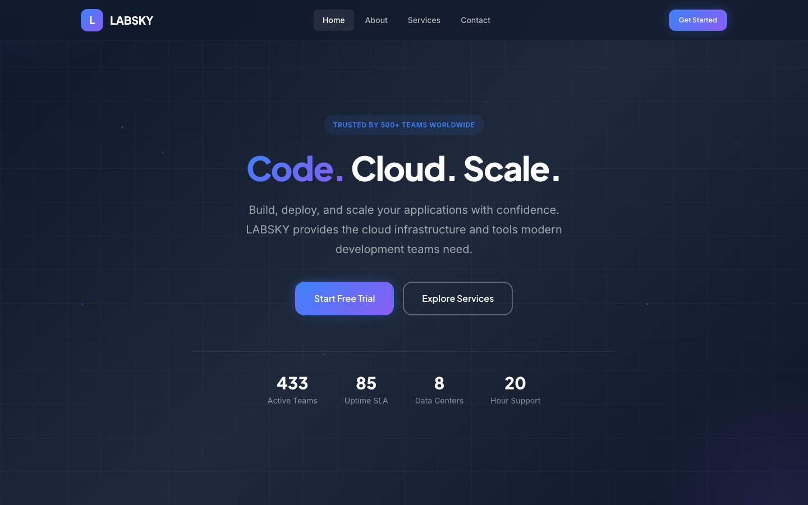

# LABSKY — Tech Startup / SaaS HTML Template

> **Code. Cloud. Scale.**

A premium, framework-free HTML template designed for tech startups and SaaS companies. Built with modern CSS custom properties, semantic HTML5, and vanilla JavaScript. No build tools, no dependencies, no complexity.

---

## 📸 Screenshot



## Live Demo

Open `index.html` in your browser to preview the template locally.

---

## Pages

| Page | File | Description |
|------|------|-------------|
| **Home** | `index.html` | Hero with gradient background, features grid, pricing table (3 tiers), testimonials, CTA, and footer |
| **About** | `about.html` | Company story, core values, and team member profiles |
| **Services** | `services.html` | Detailed service cards (Cloud IDE, Deploy, Edge Functions, Observability, Auto-Scaling, Security), process steps, technology support |
| **Contact** | `contact.html` | Contact form with validation, info cards, FAQ section |

---

## Features

- **Pure HTML/CSS/JS** -- zero dependencies, no build step required
- **Design system** -- 200+ CSS custom properties for colors, typography, spacing, shadows, and transitions
- **Responsive** -- fluid layout with breakpoints at 980px (tablet) and 720px (mobile)
- **Dark hero / light body** -- modern SaaS aesthetic with blue (#3B82F6) and violet (#8B5CF6) gradient accents
- **Animated reveals** -- IntersectionObserver-powered scroll animations with staggered children
- **Form validation** -- client-side validation with success/error feedback states
- **Reduced motion** -- respects `prefers-reduced-motion` for accessibility
- **Mobile navigation** -- hamburger menu with full-screen overlay
- **Sticky header** -- blurred backdrop with scroll-aware styling
- **Counter animation** -- animated stat counters on the homepage hero

---

## Typography

| Role | Font | Weight |
|------|------|--------|
| Headings | Plus Jakarta Sans | 700, 800 |
| Body | Inter | 400, 500, 600 |

Loaded from Google Fonts via `@import` in the stylesheet.

---

## Color Palette

| Token | Hex | Usage |
|-------|-----|-------|
| `--blue` | `#3B82F6` | Primary brand color |
| `--blue-dark` | `#2563EB` | Hover states |
| `--violet` | `#8B5CF6` | Secondary brand color |
| `--dark` | `#0F172A` | Dark backgrounds, text |
| `--white` | `#FFFFFF` | Light backgrounds |
| `--gray-50` to `--gray-600` | System grays | Borders, muted text |

---

## Images

The template references 12 images in `assets/img/`:

| File | Used In |
|------|---------|
| `about-1.jpg` | About page, company story |
| `about-2.jpg`, `about-3.jpg` | Available for content |
| `carousel-1.jpg`, `carousel-2.jpg` | Available for carousels |
| `footer.png` | Footer area |
| `team-1.jpg` through `team-5.jpg` | Team member profiles |
| `testimonial.jpg` | Testimonials |

---

## Project Structure

```
tech-startup-html-template/
  assets/
    css/
      style.css          # Full design system (500+ lines)
    js/
      main.js            # Interactivity and animations
    img/
      (12 images)
  index.html             # Home page
  about.html             # About page
  services.html          # Services page
  contact.html           # Contact page
  README.md              # This file
```

---

## Customization

### Colors

Edit the `:root` custom properties in `assets/css/style.css`:

```css
:root {
  --blue: #3B82F6;
  --violet: #8B5CF6;
  --dark: #0F172A;
  /* ... */
}
```

### Typography

Update the `@import` URL in `style.css` and the `--font-heading` / `--font-body` variables to swap fonts.

### Content

All content is plain HTML -- edit directly in the `.html` files. No templating engine required.

---

## Browser Support

- Chrome / Edge (latest)
- Firefox (latest)
- Safari (latest)
- Mobile Safari / Chrome on iOS and Android

---

## License

Free for personal and commercial use. No attribution required.
